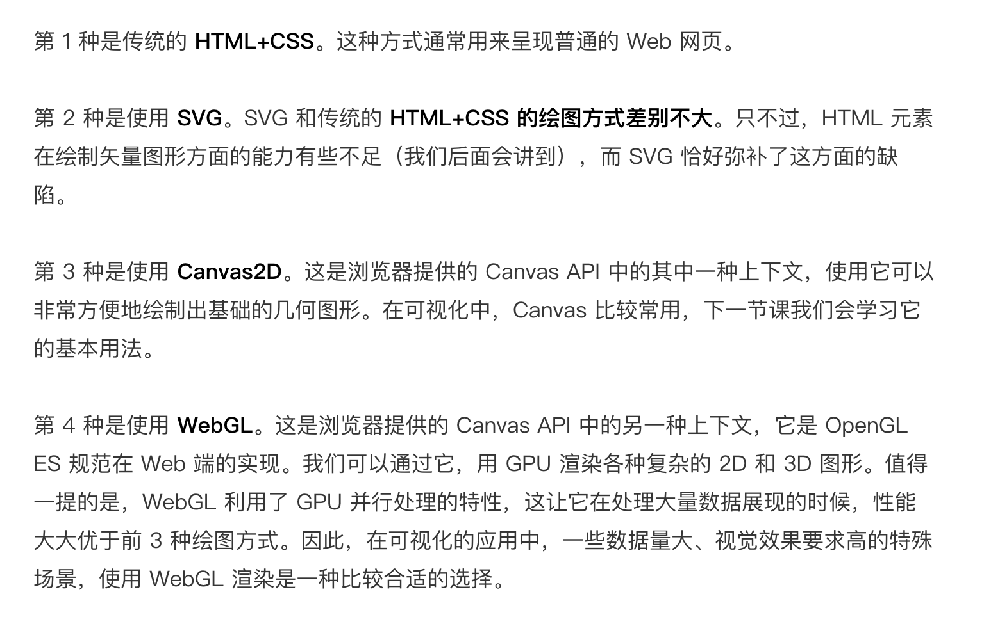
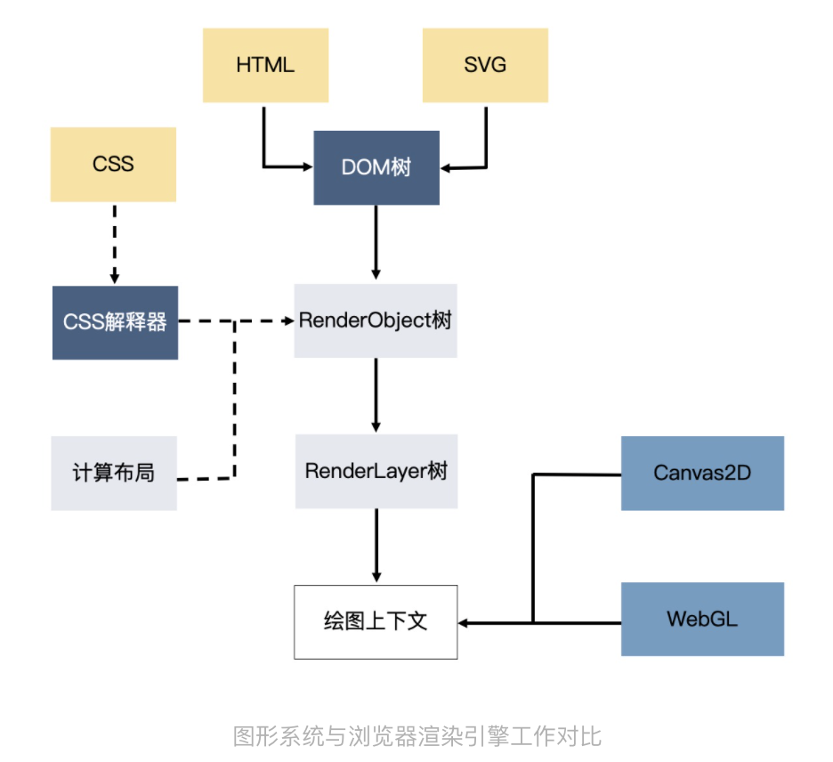
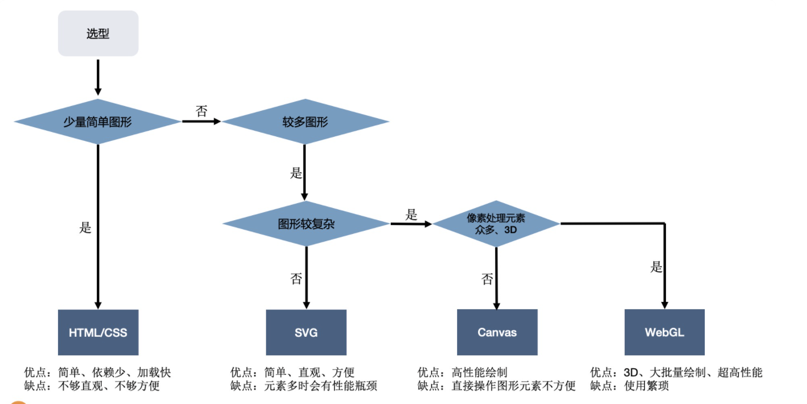

# 浏览器可视化的四种方式

### HTML+CSS
  缺点
  * HTML 和 CSS 主要为网页布局而创造的，虽能绘制可视化图表，但是绘制的方式并不简洁。因为从 CSS 代码里，很难看出数据与图形的对应关系，**换算需要开发来做**。一旦图表或数据发生改动，需要重新计算，维护起来会很麻烦。
  * HTML 和 CSS 作为浏览器渲染引擎的一部分，为了完成页面渲染的工作，除了绘制图形外，还要做很多额外的工作。比如说，浏览器的渲染引擎在工作时，要先解析 HTML、SVG、CSS，构建 DOM 树、RenderObject 树和 RenderLayer 树，然后用 HTML（或 SVG）绘图。当图形发生变化时，我们很可能要重新执行全部的工作，**性能开销是非常大**。

  对于可视化来说，不需要复杂的布局，主要是绘图和数据计算，直接操作绘图上下文，不需要传统网页的解析，构建，额外的消耗性能。
  

### SVG

现代浏览器支持 SVG（Scalable Vector Graphics，可缩放矢量图），SVG 是一种**基于 XML 语法的图像格式**，可以用图片（img 元素）的 src 属性加载。浏览器可以内嵌 SVG 标签，并且像操作普通的 HTML 元素一样，利用 DOM API 操作 SVG 元素。甚至，CSS 也可以作用于内嵌的 SVG 元素。

缺点：在渲染引擎中，SVG 元素和 HTML 元素一样，在输出图形前都**需要经过引擎的解析、布局计算和渲染树生成**。而且一个 SVG 元素只表示一种基本图形，如果展示的数据很复杂，生成图形的 SVG 元素就会很多。这样，大量的 SVG 元素会占用很多内存空间，增加引擎、布局计算和渲染树生成的开销，降低性能，减慢渲染速度。因此只**适合应用于元素较少的简单可视化场景**。

### Canvas2D
HTML/CSS SVG都属于声明式绘图系统，就是我们根据数据创建各种不同的图形元素（或者 CSS 规则），然后利用浏览器渲染引擎解析它们并渲染出来。
Canvas2D 不同，它是浏览器提供的一种可以直接用代码在一块平面的“画布”上绘制图形的 API，使用它来绘图更像是传统的“编写代码”，简单来说就是调用绘图指令，然后引擎直接在页面上绘制图形。属于命令式的绘图系统。

HTML 和 SVG 一个元素对应一个基本图形，所以可以很方便地操作它们，比如在柱状图的某个柱子上注册点击事件。
而同样的功能在 Canvas 上就比较难实现了，因为对于 Canvas 来说，绘制整个柱状图的过程就是一系列指令的执行过程，其中并没有区分“A 柱子”、“B 柱子”，这让我们很难单独对 Canvas 绘图的局部进行控制。（通过数学计算是可以通过定位的方式来获取局部图形的，然后实现功能）

一般都是讲Canvas2D与SVG进行结合使用。

### WebGL
WebGL 是基于 OpenGL ES 规范的浏览器实现的，API 相对更底层。
在以下的情况建议使用WebGL进行绘制
* **要绘制的图形数量非常多**，比如数万个图形
* **对较大图像的细节做像素处理**（实现物体的光影、流体效果和一些复杂的像素滤镜，由于这些效果往往要精准地改变一个图像全局或局部区域的所有像素点，要计算的像素点数量非常的多，一般是数十万甚至上百万数量级的）
* **绘制3D图形**，webgl内置了3D物体的深度，投影检测特性

