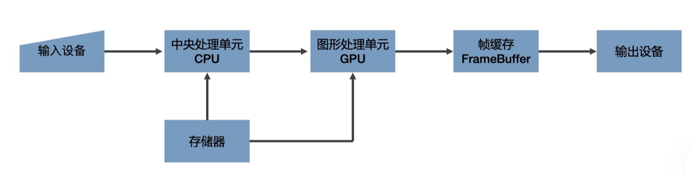
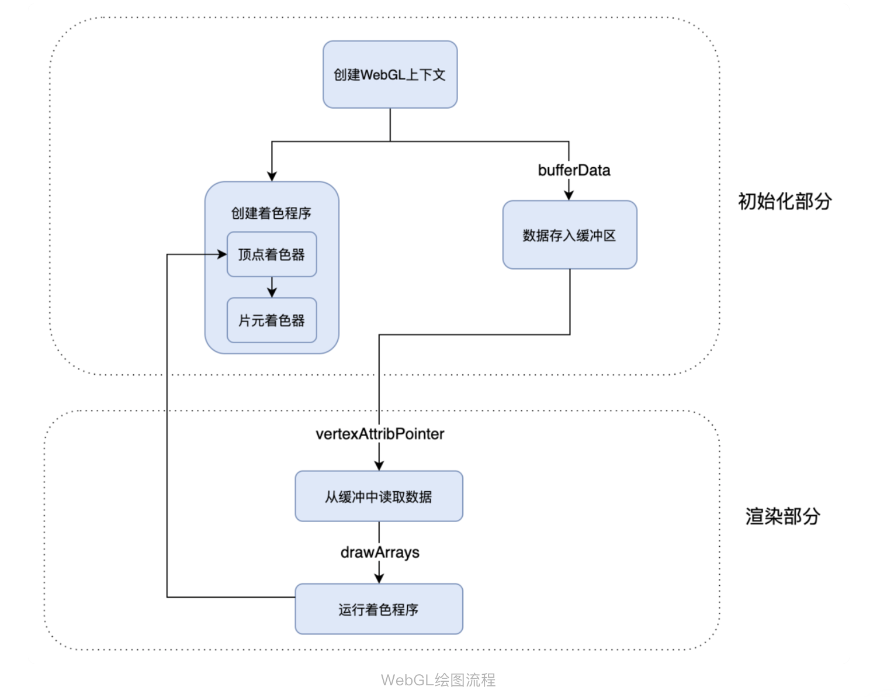

## 图形系统绘制的过程

* **光栅**（Raster）：构成图像的像素阵列
* **像素**（Pixel）：一个像素对应图像上的一个点，它通常保存图像上的某个具体位置的颜色等信息
* **帧缓存**（Frame Buffer）：在绘图过程中，像素信息被存放于帧缓存中，帧缓存是一块内存地址，可以放在内存中或者显存中

**渲染管线**：数据经过CPU 处理，成为具有特定结构的几何信息。然后，这些信息会被送到 GPU 中进行处理。在 GPU 中要经过两个步骤生成光栅信息。这些光栅信息会输出到帧缓存中，最后渲染到屏幕上，渲染管线即整个图像渲染的流程。

## WebGL绘制三角形
1. 创建 WebGL 上下文
2. 创建 WebGL 程序（WebGL Program）
3. 将数据存入缓冲区
4. 将缓冲区数据读取到 GPU
5. GPU 执行 WebGL 程序，输出结果

例子：
1. 创建 WebGL 上下文
   1.
2. 创建 WebGL 程序（WebGL Program）
3. 将数据存入缓冲区
4. 将缓冲区数据读取到 GPU
5. GPU 执行 WebGL 程序，输出结果

**顶点着色器（Vertex Shader）**：负责处理图形的顶点信息，改变绘制出来的图形的形状或者大小。
**片元着色器（Fragment Shader）**：负责处理光栅化后的像素信息。（无论有多少个像素点，片元着色器都可以同时处理）

两个的联系：顶点着色器处理完顶点之后，WebGL 就会根据顶点和绘图模式指定的图元，计算出需要着色的像素点，然后对它们执行片元着色器程序。简单来说，就是对指定图元中的像素点着色。

**光栅化过程**：WebGL 从顶点着色器和图元提取像素点给片元着色器执行代码的过程，就是生成光栅信息的过程。

**图元**是 WebGL 可以直接处理的图形单元，所以其他非图元的图形最终必须要转换为图元才可以被 WebGL 处理。例如：要绘制实心的四边形，就需要将四边形拆分成两个三角形，再交给 WebGL 分别绘制出来。

一般来说，在 WebGL 中要完成图形的绘制，需要创建 WebGL 程序，然后将图形的几何数据存入数据缓冲区，在绘制过程中让 WebGL 从缓冲区读取数据，并且执行着色器程序。

WebGL 的着色器程序有两个。一个是顶点着色器，负责处理图形的顶点数据。另一个是片元着色器，负责处理光栅化后的像素信息。此外，我们还要牢记，WebGL 程序有一个非常重要的特点就是能够并行处理，无论图形中有多少个像素点，都可以通过着色器程序在 GPU 中被同时执行。



过程
```
const vertex = `
attribute vec2 position;
varying vec3 color;

void main() {
    gl_PointSize = 1.0;
    color = vec3(0.5 + position * 0.5,0);
    gl_Position = vec4(position * 0.5, 1.0, 1.0);
}
`;

const fragment = `
precision mediump float;
varying vec3 color;

void main() {
    gl_FragColor = vec4(color,1.0);
}
`;
/** @type {HTMLCanvasElement} */

const canvas = document.getElementById("tutorial");
const webgl = canvas.getContext("webgl");

//创建shader
const vertexShader = webgl.createShader(webgl.VERTEX_SHADER);
webgl.shaderSource(vertexShader, vertex);
webgl.compileShader(vertexShader);

const fragmentShader = webgl.createShader(webgl.FRAGMENT_SHADER);
webgl.shaderSource(fragmentShader, fragment);
webgl.compileShader(fragmentShader);

//创建program，讲上面两个shader关联到program上
const program = webgl.createProgram();
webgl.attachShader(program, vertexShader);
webgl.attachShader(program, fragmentShader);
webgl.linkProgram(program);
webgl.useProgram(program);

//定义数组顶点，用于和实际的顶点数据进行一一对应
const points = new Float32Array([-1, -1, 0, 1, 1, -1]);
// const points = new Float32Array([-0.5, -0.5, 0, 0.5, 0.5, -0.5]);

//创建缓冲区
const bufferId = webgl.createBuffer();
webgl.bindBuffer(webgl.ARRAY_BUFFER, bufferId);
webgl.bufferData(webgl.ARRAY_BUFFER, points, webgl.STATIC_DRAW);

const vPosition = webgl.getAttribLocation(program, "position");
webgl.vertexAttribPointer(vPosition, 2, webgl.FLOAT, false, 0, 0);
webgl.enableVertexAttribArray(vPosition);

webgl.clear(webgl.COLOR_BUFFER_BIT);
webgl.drawArrays(webgl.TRIANGLES, 0, points.length / 2);

```